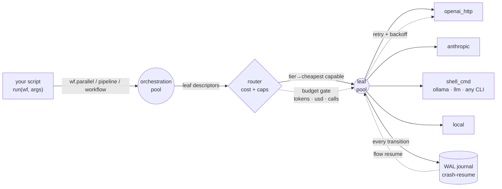

<div align="center">

# 🍃 flow

### the dynamic-workflow engine for **any agent, any model**

_Your code owns the orchestration. Models do bounded leaf work that runs **concurrently**, routes by **cost**, enforces **JSON schemas**, retries **transient failures**, and **resumes after a crash**._

[](https://github.com/Illuminfti/flow/actions/workflows/tests.yml)
[](https://github.com/Illuminfti/flow/actions/workflows/lint.yml)


```python
findings = wf.parallel([
    lambda lens=lens: wf.agent(f"audit {repo} for {lens} bugs", schema=BUG, tier="quality")
    for lens in ("correctness", "security", "performance")
])
```

_Three models, three lenses, one wall-clock second. Verified, budgeted, resumable._

</div>

---

## What it is

`flow` is the Claude-Code-Workflow pattern, set free: a tiny engine where **the script — written by you, or authored by a model from a one-line task — expresses fan-out, pipelines, and verification**, and the engine runs the leaves across a real concurrency pool, picks the cheapest capable model per leaf, validates structured output, retries flaky calls, and writes a crash-resumable journal.

Model-agnostic. Agent-agnostic. **Zero required dependencies.** Point Claude Code, a Hermes agent, or any tool-using LLM at it.



## Why it's different

|                                     |                        **flow**                         |    Claude Code Workflow    |
| ----------------------------------- | :-----------------------------------------------------: | :------------------------: |
| Runs anywhere                       |                ✅ any box, `pip install`                | ❌ inside Claude Code only |
| Any model                           | ✅ OpenAI · Anthropic · Ollama · DeepSeek · **any CLI** |       ❌ Claude only       |
| Per-leaf **cost-aware** routing     |             ✅ tiers pick cheapest capable              |        ❌ one tier         |
| Crash-resume across processes       |              ✅ fsync'd WAL, `flow resume`              |    ⚠️ same-session only    |
| Transient-error **retry + backoff** |                       ✅ built-in                       |             ❌             |
| Schema output + auto-repair         |              ✅ + budget-gated repair turn              |             ✅             |
| True concurrency, no async          |                    ✅ two-tier pools                    |        ✅ (~16 cap)        |
| Dependencies                        |                 **0** (stdlib `urllib`)                 |            n/a             |
| License                             |                   MIT, yours to fork                    |        proprietary         |

## Install

```bash
pipx install "git+https://github.com/Illuminfti/flow"
# or:  pip install "flow[yaml,anthropic] @ git+https://github.com/Illuminfti/flow"
# or:  uv tool install "git+https://github.com/Illuminfti/flow"
```

> PyPI release (`pipx install flow`) coming soon; install from git for now.

## 30-second quickstart

```bash
export OPENAI_API_KEY=sk-...      # or any OpenAI-compatible key
flow init                         # writes ~/.config/flow/config.yaml
flow self-test --offline          # proves the engine runs — no network
flow run --nl "summarize the top 3 risks of running trading bots on one server"
```

## In Python

```python
from flow import run_workflow

BUG = {"type": "object", "required": ["title", "severity"],
       "properties": {"title": {"type": "string"}, "severity": {"type": "string"}}}

def run(wf, args):
    wf.phase("review")
    findings = wf.parallel([
        (lambda lens=lens: wf.agent(f"Review {args['files']} for {lens} bugs. Worst one only.",
                                    label=f"review:{lens}", schema=BUG, tier="quality"))
        for lens in ["correctness", "security", "performance"]
    ])
    wf.phase("verify")
    return wf.parallel([
        (lambda f=f: wf.agent(f"Refute if false: {f}", label="verify", tier="cheap", required=False))
        for f in findings if f
    ])

report = run_workflow(run_fn=run, args={"files": ["app.py"]}, budget={"max_usd": 1})
print(report["final"], report["spend"])
```

## The `wf` API — nine methods, that's the whole thing

```python
wf.agent(prompt, *, label, schema, tier, model, provider, required, max_tokens, timeout)  # one model leaf
wf.local(fn, *args, **kwargs)            # a deterministic no-model leaf (real Python)
wf.parallel([thunk, ...])                # run thunks concurrently
wf.pipeline(items, *stages)              # streaming fan-out through stages
wf.workflow(child_fn, inputs)            # nested workflow, shared pool, no depth cap
wf.phase(name)                           # checkpoint
wf.log(msg, **fields) / wf.notify(msg)   # journal / escalate
wf.spend() / wf.remaining() / wf.has_headroom()   # token + usd + calls budget
```

## Models & routing

One config file (`~/.config/flow/config.yaml`) — add any model with **zero code edits**. Define `providers`, `models` (with pricing + capabilities), and `tiers`. The router filters by capability and picks **minimum cost** within the tier. A light-model denylist is on by default (opt out with `leaf.allow_light_models: true`). → [docs/config.md](docs/config.md)

## Backends

`openai_http` (default, stdlib · OpenAI/DeepSeek/Groq/Together/Mistral/OpenRouter/Ollama/LM Studio/vLLM) · `codex` (**ChatGPT Pro/Plus subscription** via the Codex Responses endpoint) · `anthropic_sdk` · `shell_cmd` (drive **any** CLI — `ollama run`, `llm`, `codex`, `claude -p`, `hermes chat`) · `local`. Add your own with `register_backend()`. → [docs/backends.md](docs/backends.md)

## Use your subscriptions, not just API keys

Drive flow with the OAuth products you already pay for — **ChatGPT Pro (Codex), Claude Max, Grok** — at no per-token cost. Generic token sources (`auth_env` / `auth_file` + `auth_field` / `auth_cmd`) + custom headers mean any OAuth token works anywhere an API key would, and `shell_cmd` routes through your authenticated CLI directly. → **[docs/subscriptions.md](docs/subscriptions.md)**

## Crash & resume

```bash
flow run myflow.py --run-id audit-42      # crashes? kill it, then:
flow resume audit-42 myflow.py            # completed leaves are skipped, not recomputed
flow trace audit-42                        # per-leaf model / cost / latency / retries
flow trace audit-42 --json                 # structured spans (machine-readable)
```

Resume is **leaf-level**: it replays the WAL and skips any leaf that reached a
terminal state, re-running interrupted ones — not a full workflow-graph snapshot.
**Schema** validation uses `jsonschema` when installed (`flow[schema]` — full
nested/enum/array/oneOf checks); without it, a documented top-level subset.

## Patterns

Six reusable patterns ship in [`examples/patterns/`](examples/patterns) — classify-and-act,
fan-out-and-synthesize, adversarial verification, generate-and-filter, tournament (pairwise
comparative judgment), and loop-until-done — each fighting a specific failure mode (agentic
laziness, self-preferential bias, goal drift). See **[docs/patterns.md](docs/patterns.md)**.

> Workflows cost **significantly more tokens** — use them for complex, high-value tasks, not
> ordinary ones. Always set a `--budget`. Patterns & framing distilled from Anthropic's
> [_A harness for every task_](https://claude.com/blog/a-harness-for-every-task-dynamic-workflows-in-claude-code).

## For AI agents

Setting this up _as an agent_? Read **[AGENTS.md](AGENTS.md)** — it's written for you.

**Install as a skill** (Claude Code / Hermes / any skill-aware agent): drop [`skill/SKILL.md`](skill/SKILL.md) into your skills dir so your agent reaches for flow automatically —

```bash
mkdir -p ~/.claude/skills/flow && curl -fsSL \
  https://raw.githubusercontent.com/Illuminfti/flow/main/skill/SKILL.md \
  -o ~/.claude/skills/flow/SKILL.md
```

## What's tested vs. what's not (read before trusting a claim)

- **Tested core (unit + clean-install CI):** concurrency, crash-resume (leaf-level), token/usd/calls budgets, schema enforce+repair, retry/backoff, router selection, `local`/`shell_cmd` backends, the offline example.
- **Verified live, ad-hoc:** the `codex` (ChatGPT Pro) backend; `openai_http` request/auth/error handling against a real OpenAI-compatible server.
- **Not yet in CI:** real Anthropic calls, OAuth/subscription routes end-to-end, kill-mid-run crash/resume — these are credential-gated and proven only by hand.
- **Behaviour to know:** `wf.parallel`/`wf.pipeline` turn a failed thunk/stage into `None` + a warning (check results, or raise yourself); `flow trace` shows `provider/model: null` for leaves that failed _before_ a backend call (e.g. auth); resume reuses a leaf only when `(script, phase, label, prompt, route, schema)` are all identical.

## License

MIT © Illumi ([@Illuminfti](https://github.com/Illuminfti)) · contributions welcome
