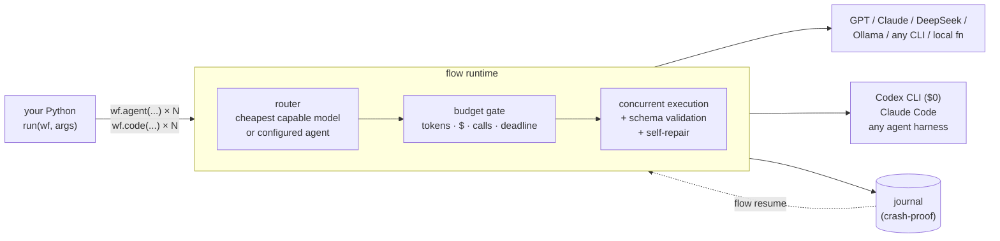
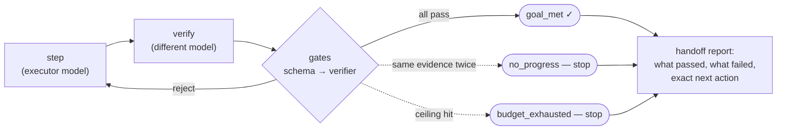
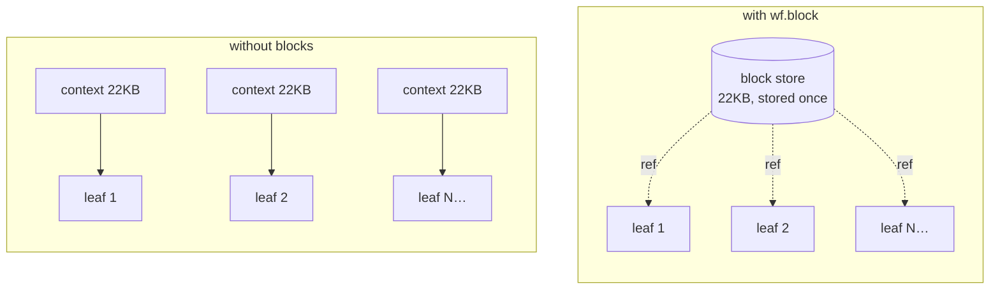

<div align="center">

# flow

### Point an agent at a backlog. Get back merged, tested commits.

flow is the orchestration runtime that closes the loop most agent frameworks leave open —
it fans work across any model, **proves every result**, survives a kill -9, and ships the
outcome to your branch. Zero human in the loop. Zero third-party dependencies.

[](https://github.com/Illuminfti/flow/actions/workflows/tests.yml)
[](https://github.com/Illuminfti/flow/actions/workflows/install-smoke.yml)
[](https://github.com/Illuminfti/flow/actions/workflows/lint.yml)


</div>

---

> **Receipts, not adjectives.** Every number below is measured and reproducible from this repo.
>
> |                               |                                                                                                      |
> | ----------------------------- | ---------------------------------------------------------------------------------------------------- |
> | **0.75 zero-touch ship rate** | a real 4-task backlog → 3 tasks merged to `main`, suite green (8→14 tests), **0 human touches**      |
> | **−83.5% tokens**             | a fan-out that died at 906k tokens completed at 135k under the _same_ ceiling — `failed → completed` |
> | **$0**                        | every leaf above ran on Codex via a ChatGPT subscription, not metered API                            |
> | **kill -9 → resume**          | SIGKILL mid-run, `flow resume`, completed work never re-runs — proven by real subprocess tests       |
> | **205 hermetic tests**        | no network, green in CI; live provider routes are credential-gated                                   |

## The loop most agent frameworks never close

Spin up parallel sub-agents and you get speed — and a mess. Loose patches you still
have to integrate. A model grading its own homework. A surprise bill at 3 a.m. A run
that dies on a rate limit and starts over from zero.

flow is built around the parts everyone skips:

- **It proves results instead of trusting them.** JSON schema at every leaf; a _different_
  model as the verifier (it refuses to start if the verifier is the executor); real
  test/build commands as merge gates — green receipts on disk, or it doesn't ship.
- **It can't overspend.** Token, dollar, call, and deadline ceilings are enforced _before_
  each call and replayed across crash-restarts. One flag and the run physically can't
  exceed it.
- **It survives anything.** An fsync'd write-ahead journal means a reboot, a `kill -9`, or
  a rate-limit death costs you nothing — `flow resume` skips every finished leaf.
- **It ships.** Coding agents run in isolated checkouts and hand back patches; flow proof-gates
  them, repairs conflicts, and auto-merges to your branch behind a fail-closed allowlist —
  auto-reverting if a post-merge canary goes red.

You write one Python function. Your code owns the control flow; models do the bounded work
you hand them. That inversion is the whole design.

## Watch it ship

A backlog goes in. Merged, proven commits come out — nobody watching.

```python
# examples/v4_autonomous_backlog.py
def run(wf, args):
    wf.phase("implement")                       # one coding agent per task,
    receipts = wf.parallel([                     # each in its own isolated checkout
        (lambda t=t: wf.code(t["prompt"], agent="coder", workspace=args["repo"],
                             isolation="worktree", label=t["id"], required=False))
        for t in args["backlog"]])

    wf.phase("ship")                             # proof-gate → repair → auto-merge → canary
    return wf.merge(receipts, repo=args["repo"], target_branch="main",
                    checks=[{"name": "suite",  "command": ["pytest", "-q"]}],
                    canary=[{"name": "canary", "command": ["pytest", "-q"]}],
                    auto_merge=True)             # promotes only if the repo is allowlisted
```

Run against a real repo, this shipped **3 of 4 tasks straight to `main`** — each one
applied, tested, and committed without a human — while the 4th was _exiled_ on an
unresolvable conflict instead of force-merged. The test suite grew 8 → 14 and stayed
green. Cost: **$0**.

Autonomous merge is **gated, not trusted**: a patch that edits an existing test is sent to
a cross-vendor reviewer and fails closed; a flaky check is quarantined, not believed;
auto-merge fires only for an allowlisted repo; a red canary reverts the merge and exiles the
batch. [Full guide →](docs/merge.md)

## How it fits together



Any model, any provider — API key **or** the subscriptions you already pay for
(ChatGPT Pro, Claude Max). The entire core runtime is the Python standard library.

## 60-second start

```bash
pipx install "git+https://github.com/Illuminfti/flow"

flow self-test --offline     # proves the engine works — no key, no network
export OPENAI_API_KEY=sk-...  # or DeepSeek / Ollama / Anthropic / a subscription
flow init && flow doctor

# describe the job; flow authors AND runs the workflow:
flow run --nl "review this repo for the three highest-risk release blockers" \
  --budget '{"max_usd":1,"max_calls":8}'

flow trace <run_id>          # per-leaf model / cost / latency / retries
```

Optional extras: `flow[yaml]` · `flow[schema]` (full JSON Schema) · `flow[anthropic]` · `flow[all]`.

## What you can build

| You want to…                                | flow gives you                                                                                                              |
| ------------------------------------------- | --------------------------------------------------------------------------------------------------------------------------- |
| Fan out 20 checks / lenses / files at once  | `wf.parallel`, `wf.pipeline` — real concurrency, per-leaf failure policy                                                    |
| Trust model output                          | JSON Schema at every leaf; malformed output is self-repaired with the exact error, then fails loudly                        |
| Never get a surprise bill                   | hard token/USD/call/deadline budgets, enforced _before_ each call and across crash-restarts                                 |
| Iterate until the result is actually good   | `wf.loop`: bounded retry-until-verified with a **different model as the judge** — no self-grading                           |
| Stop paying N× for the same context         | `wf.block`: store shared context once, siblings get a reference (fan-outs measured 53–89% redundant without it)             |
| Survive crashes, reboots, rate-limit deaths | fsync'd journal; `flow resume` skips all completed work                                                                     |
| Fan out real coding agents in parallel      | `wf.code` + `isolation="worktree"`: N agents in isolated checkouts, changes come back as patches — your live repo untouched |
| Ship a backlog with no human in the loop    | `wf.merge`: proof-gate, repair, auto-merge behind a money fence, auto-revert on a red canary                                |

**Don't** reach for it for one-shot prompts or deterministic ETL — workflows multiply calls.
Always set a budget.

## A 20-line example

Fan out three review lenses, then adversarially verify each finding with a cheaper model:

```python
FINDING = {"type": "object", "required": ["title", "severity"]}

def run(wf, args):
    wf.phase("review")
    findings = wf.parallel([
        lambda lens=lens: wf.agent(f"Review {args['target']} for one {lens} issue. JSON only.",
                                   label=f"review:{lens}", schema=FINDING, tier="quality")
        for lens in ("correctness", "security", "performance")])

    wf.phase("verify")
    return wf.parallel([
        lambda f=f: wf.agent(f"Try to refute this finding: {f}",
                             label="verify", tier="cheap", required=False)
        for f in findings if f])
```

```bash
flow run review.py --args '{"target":"src/"}' --budget '{"max_usd":1}'
```

## Iterate until an independent judge accepts it

The piece most frameworks fake: a **bounded** loop that improves a candidate until a
**different** model accepts it — and stops itself when it's stuck, broke, or done.



```python
from flow import LoopSpec

return wf.loop(
    spec=LoopSpec(goal="a verified report section", max_iterations=5,
                  required_gates=["schema", "verifier"], stall_limit=2,
                  verifier_policy={"tier": "verify", "must_differ_from_executor": True}),
    step=lambda wf, ctx: wf.agent(f"{ref}\n\nDraft the section. Fix: {ctx['prev_gates']}",
                                  label=f"draft:{ctx['iteration']}", schema=SECTION, tier="quality"),
    verify=lambda wf, ctx: wf.agent(f'Adversarially review: {ctx["candidate"]}. '
                                    'JSON: {"verdict":"accept"|"reject","issues":[...]}',
                                    label=f"verify:{ctx['iteration']}", tier="verify"))
```

Trustworthy rather than vibes: **no self-grading** (fails closed if the verifier resolves to
the executor), **deterministic stops** (`goal_met → max_iterations → no_progress →
budget_exhausted → cancelled`), **stall detection** that halts on repeated evidence _before_
the token wall, and a **handoff report** on every stop with a concrete next action — never a
bare `"failed"`. Completed iterations never re-run after a crash. [Full guide →](docs/loop.md)

## Don't pay N× for the same context

Wide fan-out's hidden cost is every sibling re-ingesting the same context — the dominant spend
at scale (real runs: **53–89% redundant input**).



```python
ref = wf.block(huge_context)              # sha256-addressed, charged once per scope
wf.agent(f"Analyze lens X.\n\n{ref}")     # every sibling embeds the ref, not the blob
```

**Receipt:** a 25-leaf research run that died at 906,313 / 900,000 tokens was replayed under
the _same_ ceiling and completed at 205,073 (input 822,120 → 135,619, **−83.5%**), stopping on
`goal_met` via an independent verifier. The dedup rate is _measured_ from per-leaf input
hashes, not estimated.

## Coding agents as leaves

Each leaf can be a **full CLI coding agent** — Codex, Claude Code, or any harness — that uses
its own tools (edit files, run commands, own a workspace) and returns a structured receipt
with real spend, a continuation handle, and patch evidence. All inside the budget gate,
crash-resume journal, and schema enforcement.


```python
receipt = wf.code(
    "Create fizzbuzz.py with a fizzbuzz(n) function. Reply JSON {\"verdict\": \"done\"}.",
    agent="coder", workspace=args["repo"], isolation="worktree",
    schema={"type": "object", "required": ["verdict"]}, label="fizzbuzz")
# receipt["patch"]["files"]  → what changed   ·   receipt["session_id"] → chain a follow-up
# receipt["spend"]           → real usage     ·   live repo never touched
```

Harness behavior lives in config, not per-leaf code — `coder` is Codex at $0, `reviewer` is
a cross-vendor Claude. [Full guide →](docs/agents.md)

#### vs Claude Code Workflow — honest

|                                     | flow                                       | Claude Code Workflow |
| ----------------------------------- | ------------------------------------------ | -------------------- |
| Vendor                              | any (Codex=$0, Claude, generic)            | Claude only          |
| Pre-spend budget gate               | yes — kill-proof, replays across restarts  | varies               |
| Parallel agent mutation, same repo  | safe (isolated checkouts + patch evidence) | not designed for it  |
| Crash resume                        | yes — a completed agent leaf never re-runs | session-bound        |
| Independent (cross-vendor) verifier | yes (`wf.loop`)                            | manual               |
| **Proof-gated auto-merge + revert** | **yes (`wf.merge`)**                       | **none**             |
| Interactive UI                      | `flow watch` (live progress)               | richer built-in UI   |

CC Workflow's leaves are first-class CC subagents with a nicer interactive UI. flow's ground
is everywhere else: any vendor at $0, hard budgets, crash resume, and the entire **prove →
integrate → ship** layer it has no equivalent for.

## The whole API

```python
wf.agent(prompt, *, label, schema, tier, model, provider, backend, max_tokens, timeout, tools, required)
wf.code(prompt, *, agent, label, workspace, isolation, schema, continue_id, reserve_tokens, timeout, required)
wf.merge(patches, *, repo, target_branch, checks, canary, auto_merge, max_repairs)
wf.loop(spec=LoopSpec(...), step, verify)        # bounded iterate-to-goal
wf.block(text) / wf.resolve_blocks(text)         # shared-context dedup
wf.parallel([thunk, ...])                        # lenient | fail_fast | collect_errors
wf.pipeline(items, *stages)                      # per-item flow, no barriers
wf.local(fn, *args) · wf.workflow(child_fn, inputs) · wf.phase(name)
wf.spend() · wf.remaining() · wf.has_headroom() · wf.cancelled() · wf.log/notify(...)
```

```bash
flow run workflow.py --args '{...}' --budget '{"max_usd":1}'
flow run --nl "<task>"            # model authors the workflow, flow validates + runs it
flow resume <run_id> workflow.py  # finish a crashed run, completed work is free
flow trace <run_id>               # per-leaf model/cost/latency/retries/repairs
flow watch <run_id>               # live progress as leaves complete
flow author / list / status / doctor / self-test / init
```

## Backends

| Backend         | Reaches                                                                     | Tools        |
| --------------- | --------------------------------------------------------------------------- | ------------ |
| `openai_http`   | OpenAI, DeepSeek, OpenRouter, Groq, Together, Ollama, any compatible server | yes          |
| `anthropic_sdk` | Claude (native SDK)                                                         | yes          |
| `codex`         | ChatGPT-subscription Codex route ($0 with ChatGPT Pro)                      | fails closed |
| `agent_cli`     | full CLI coding-agent harnesses (codex / claude / generic) via `wf.code`    | agent-owned  |
| `shell_cmd`     | any authenticated CLI — local models, custom bridges                        | fails closed |
| `local`         | plain Python functions                                                      | n/a          |

Models, tiers, and pricing are pure config — one JSON/YAML file, no code.
See [`docs/config.md`](docs/config.md) and [`docs/subscriptions.md`](docs/subscriptions.md).

## Trust, but verify

**205 hermetic tests** run in CI with no network: concurrency, budgets, deadlines,
cancellation, schema repair, crash-resume via real `SIGKILL` subprocesses, budget replay
across restarts, loop stops / gates / repair routing / handoffs, deterministic stop replay,
block dedup, verifier-identity enforcement, the full merge orchestrator (proof gates, the
three guards, money fence, auto-revert), agentic leaves, and a v1 regression lock. A replay
harness re-runs real failed production manifests under their original ceilings as the
performance bar.

```bash
python -m pytest          # the same suite CI runs
flow self-test --offline
```

Authored workflows are trusted Python, not a sandbox — model-authored scripts are AST-validated
as an accident guard, not a containment boundary ([`SECURITY.md`](SECURITY.md)).

## Docs

[`index`](docs/index.md) ·
[`merge`](docs/merge.md) ·
[`agents`](docs/agents.md) ·
[`loop`](docs/loop.md) ·
[`architecture`](docs/architecture.md) ·
[`api`](docs/api.md) ·
[`cli`](docs/cli.md) ·
[`config`](docs/config.md) ·
[`backends`](docs/backends.md) ·
[`patterns`](docs/patterns.md) ·
[`comparison`](docs/comparison.md)

Wiring flow into your own agent? Read [`AGENTS.md`](AGENTS.md).

## License

MIT © Illumi [@Illuminfti](https://github.com/Illuminfti)
