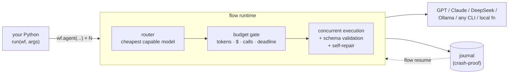
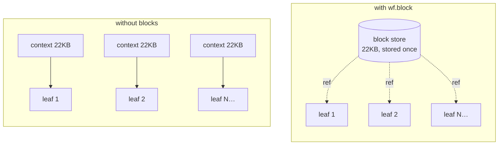
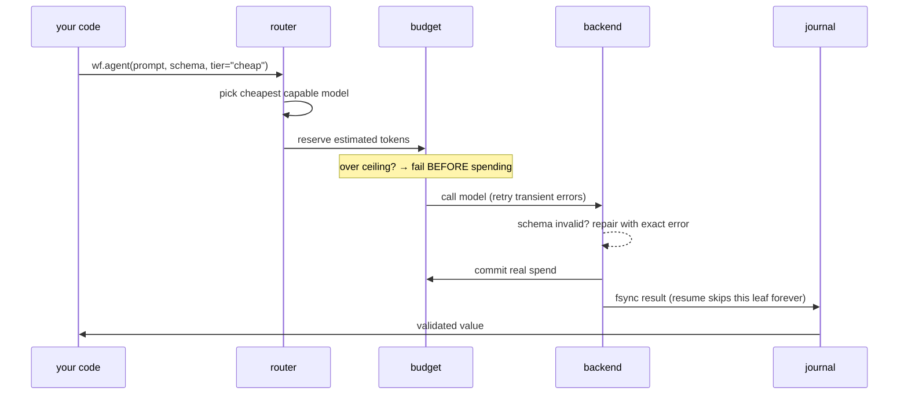

<div align="center">

# flow

### Your code orchestrates. Models do bounded work. Everything survives.

**A tiny Python runtime for multi-model LLM workflows — concurrent, budgeted,
schema-validated, crash-resumable, and able to iterate until an independent
verifier accepts the result.**

[](https://github.com/Illuminfti/flow/actions/workflows/tests.yml)
[](https://github.com/Illuminfti/flow/actions/workflows/install-smoke.yml)
[](https://github.com/Illuminfti/flow/actions/workflows/lint.yml)


</div>

---

## What is this?

You write one Python function. It fans work out to LLMs, checks their answers,
and combines the results. `flow` makes that function **operationally safe**:
every model call runs concurrently on the cheapest capable model, must return
valid JSON (malformed output gets self-repaired), counts against a hard
token/dollar budget, and is journaled to disk — kill the process at any point
and `flow resume` picks up exactly where it died, without re-paying for
finished work.



Any model, any provider — API key **or** the subscriptions you already pay for
(ChatGPT Pro, Claude Max). Zero third-party runtime dependencies.

## Why you'd want it

| You want to…                                      | flow gives you                                                                                                             |
| ------------------------------------------------- | -------------------------------------------------------------------------------------------------------------------------- |
| Fan out 20 checks / lenses / files at once        | `wf.parallel`, `wf.pipeline` — real concurrency, per-leaf failure policy                                                   |
| Trust model output                                | JSON Schema enforced at every leaf; bad output is auto-repaired with the exact validation error, then fails loudly         |
| Not wake up to a $400 bill                        | Hard budgets (tokens, USD, calls, deadline) enforced **before** each call — and still enforced across crash-restarts       |
| Keep big shared context from being billed N times | `wf.block`: store it once, fan-out siblings get a reference (wide fan-outs measured 53–89% redundant without this)         |
| Iterate until the result is actually good         | `wf.loop`: bounded retry-until-verified, with acceptance gates and a **different model as the verifier** — no self-grading |
| Survive crashes, reboots, rate-limit deaths       | fsync'd write-ahead journal; `flow resume` skips all completed work                                                        |
| See what happened                                 | `flow trace`: per-leaf model, cost, latency, retries, repairs                                                              |

**Skip it** for one-shot prompts and deterministic ETL — workflows multiply
calls; always set a budget.

## 60-second start

```bash
pipx install "git+https://github.com/Illuminfti/flow"

flow self-test --offline    # proves the engine works — no key, no network
export OPENAI_API_KEY=sk-...    # or DeepSeek/Ollama/Anthropic/subscriptions
flow init && flow doctor

# the model authors AND runs the workflow:
flow run --nl "review this repo for the three highest-risk release blockers" \
  --budget '{"max_usd":1,"max_calls":8}'

flow trace <run_id>         # per-leaf model / cost / latency / retries
```

Extras: `flow[yaml]` (YAML config) · `flow[schema]` (full JSON Schema) ·
`flow[anthropic]` (native SDK) · `flow[all]`.

## A real workflow in 30 lines

Fan out three review lenses, then adversarially verify each finding with a
cheaper model:

```python
FINDING = {"type": "object", "required": ["title", "severity"],
           "properties": {"title": {"type": "string"}, "severity": {"type": "string"}}}

def run(wf, args):
    wf.phase("review")
    findings = wf.parallel([
        lambda lens=lens: wf.agent(
            f"Review {args['target']} for one {lens} issue. JSON only.",
            label=f"review:{lens}", schema=FINDING, tier="quality")
        for lens in ("correctness", "security", "performance")])

    wf.phase("verify")
    return wf.parallel([
        lambda f=f: wf.agent(f"Try to refute this finding: {f}",
                             label="verify", tier="cheap", required=False)
        for f in findings if f])
```

```bash
flow run review.py --args '{"target":"src/"}' --budget '{"max_usd":1}'
```

Your code is deterministic control flow; models only do the bounded leaf work
you hand them. That inversion is the whole design.

## Iterate until verified — `wf.loop` (v2)

The piece most frameworks fake: a **bounded** loop that keeps improving a
candidate until an **independent** verifier accepts it — and stops itself when
it's stuck, out of budget, or done.


```python
from flow import LoopSpec

def run(wf, args):
    ref = wf.block(args["shared_context"])        # stored once, billed once

    return wf.loop(
        spec=LoopSpec(goal="a verified report section", max_iterations=5,
                      required_gates=["schema", "verifier"], stall_limit=2,
                      verifier_policy={"tier": "verify",
                                       "must_differ_from_executor": True}),
        step=lambda wf, ctx: wf.agent(
            f"{ref}\n\nDraft the section. Fix: {ctx['prev_gates']}",
            label=f"draft:{ctx['iteration']}", schema=SECTION, tier="quality"),
        verify=lambda wf, ctx: wf.agent(
            f'Adversarially review: {ctx["candidate"]}. '
            'JSON: {"verdict":"accept"|"reject","issues":[...]}',
            label=f"verify:{ctx['iteration']}", tier="verify"))
```

What makes it trustworthy rather than vibes:

- **No self-grading.** If the verifier resolves to the executor's
  (provider, model), the loop refuses to start (`VerifierIdentityError`) —
  it never silently downgrades to a model approving its own work.
- **Deterministic stops**, in precedence order:
  `goal_met → max_iterations → no_progress → budget_exhausted → cancelled`.
  Stall detection fingerprints failures; two iterations of identical evidence
  stop the loop _before_ the token wall, not after.
- **Cheap gates run first.** Deterministic checks (schema, artifact) cost
  nothing; the LLM verifier is skipped entirely when they already failed.
- **Every stop writes a handoff** (`handoff-report.json`): verified/rejected
  split, recurring failure signatures, spend, and a concrete
  `next_bounded_action` — never a bare `"failed"`.
- **Crash-resumable.** A completed iteration never reruns; budgets replay from
  the journal, so the ceiling holds across N restarts (≤1×, not N×).

Full guide: [`docs/loop.md`](docs/loop.md).

## Shared context without the N× bill — `wf.block` (v2)

Wide fan-out has a hidden cost: every sibling re-ingests the same context, and
it's the dominant spend at scale — real runs measured **53–89% redundant input
tokens**, enough to breach a 900k ceiling on work that fits in 250k.



```python
ref = wf.block(huge_context)              # sha256-addressed, charged once
wf.agent(f"Analyze lens X.\n\n{ref}")     # sibling embeds the ref envelope
```

The budget charges the block once per scope instead of once per sibling, and
the dedup rate is **measured** from persisted per-leaf input hashes
(`flow.blocks.dedup_report`), not estimated.

**Receipt:** a real 25-leaf research run that died at 906,313 tokens against a
900k ceiling under v1 was replayed through v2 under the _same_ ceiling —
completed at 205,073 total (input 822,120 → 135,619, **−83.5%**), with the
loop stopping on `goal_met` via an independent verifier.

## How a single call actually runs



Durable leaf identity = hash of script, phase, label, prompt, route, schema,
and options. Same work → same identity → never recomputed, in this run or on
resume.

## The whole API

```python
wf.agent(prompt, *, label, schema, tier, model, provider, backend,
         max_tokens, timeout, tools, tool_approval_gates, required=True)
wf.local(fn, *args)                      # deterministic Python as a leaf
wf.parallel([thunk, ...])                # modes: lenient | fail_fast | collect_errors
wf.pipeline(items, stage1, stage2, ...)  # per-item flow, no barriers
wf.workflow(child_fn, inputs)            # nested workflow, shared pools

wf.loop(spec=LoopSpec(...), step, verify)        # v2: bounded iterate-to-goal
wf.block(text) / wf.resolve_blocks(text)         # v2: shared-context dedup

wf.phase(name) · wf.log/notify(...) · wf.spend() · wf.remaining()
wf.has_headroom(min_tokens) · wf.cancelled()
```

```bash
flow run workflow.py --args '{...}' --budget '{"max_usd":1}'
flow run --nl "<task>"            # model authors the workflow, flow validates + runs it
flow resume <run_id> workflow.py  # finish a crashed run, completed work is free
flow trace <run_id>               # per-leaf model/cost/latency/retries/repairs
flow author / list / status / doctor / self-test / init
```

## Backends

| Backend         | Reaches                                                                     | Tools        |
| --------------- | --------------------------------------------------------------------------- | ------------ |
| `openai_http`   | OpenAI, DeepSeek, OpenRouter, Groq, Together, Ollama, any compatible server | yes          |
| `anthropic_sdk` | Claude (native SDK)                                                         | yes          |
| `codex`         | ChatGPT-subscription Codex route ($0 with ChatGPT Pro)                      | fails closed |
| `shell_cmd`     | any authenticated CLI — Claude Code, local models, custom bridges           | fails closed |
| `local`         | plain Python functions                                                      | n/a          |

Models, tiers, and pricing are pure config — one JSON/YAML file, no code
(`flow init`, then see [`docs/config.md`](docs/config.md) and
[`docs/subscriptions.md`](docs/subscriptions.md)).

## What's tested

168 hermetic tests (no network) run in CI: concurrency, budgets/deadlines/
cancellation, schema repair, crash-resume (real SIGKILL subprocesses), budget
replay across restarts, loop stops/gates/repair-routing/handoffs, deterministic
stop replay, block dedup + double-charge prevention, verifier identity
enforcement, and a v1 regression lock. Live provider routes are
credential-gated. A replay harness re-runs real failed production manifests
under their original ceilings as the performance acceptance bar
(`tests/test_perf_baselines.py`).

```bash
python -m pytest          # the same suite CI runs
flow self-test --offline
```

## Security model

Authored workflows are trusted Python, not a sandbox. Model-authored scripts
are AST-validated against unsafe imports/builtins as an accident guard, not a
containment boundary. Details: [`SECURITY.md`](SECURITY.md) ·
[`docs/security.md`](docs/security.md).

## Docs

[`docs/index.md`](docs/index.md) — map ·
[`docs/loop.md`](docs/loop.md) — loop envelope ·
[`docs/architecture.md`](docs/architecture.md) — internals ·
[`docs/api.md`](docs/api.md) — Python API ·
[`docs/cli.md`](docs/cli.md) — CLI ·
[`docs/config.md`](docs/config.md) — config ·
[`docs/backends.md`](docs/backends.md) — backends ·
[`docs/patterns.md`](docs/patterns.md) — patterns ·
[`docs/testing.md`](docs/testing.md) — verification ·
[`docs/troubleshooting.md`](docs/troubleshooting.md) ·
[`docs/comparison.md`](docs/comparison.md) — positioning

Agent setting this up for yourself? Read [`AGENTS.md`](AGENTS.md).

## License

MIT © Illumi [@Illuminfti](https://github.com/Illuminfti)
